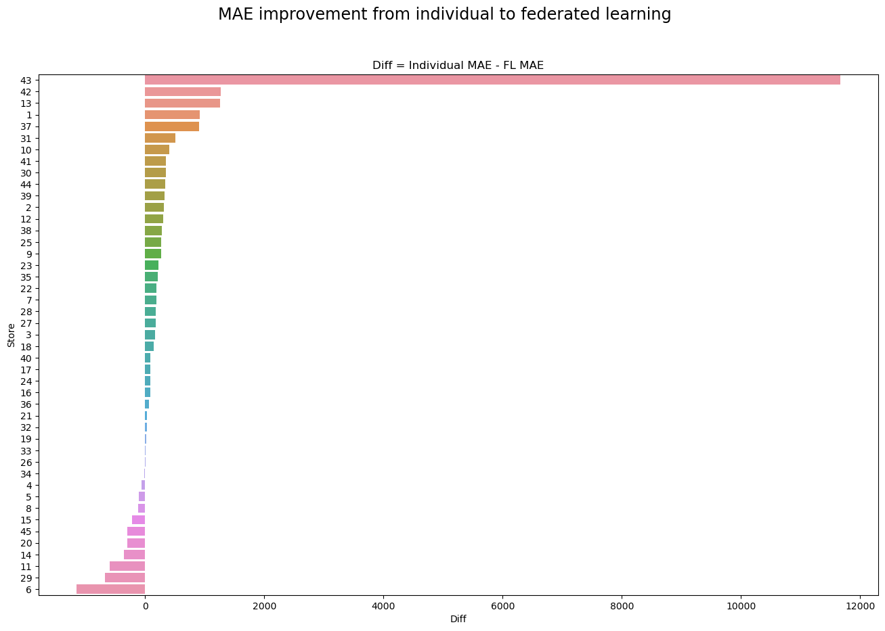

# Experiment with Federated Learning
## Project Description
In this github repository, we explore and compare the effectiveness of federated learning and traditional machine learning training methodology.
## Overview

Artifical intelligence has the potential to improve the efficency and effectiveness of every industry. Almost every business can utilise the benefit of machine learning to improve the business process, sales, inventory management, etc. However, new business or small-scale business may not have enough data to harness the potential that machine learning model has to offer. As we know, the quantity and quality of data has direct impact on the performance of any machine learning model.

One possible way for small-scale business to leverage on AI is to build a machine learning model collaboratively by working with other businesses in the same industry. For example, a local bread store can work with the other bread store to build a more robust machine learning model. Understandably, the business may feel reluctant to share sensitive data with its competitors, here's where federated learning can help to alleviate the obstacle.

Federeated Learning (FL) is a way to train the model using decentralised data. FL presented a way for business competitors to work together and improve business efficiency. This open up many doors for small business who have yet build up their data capability to harness the potential of machine learning. 

## About the Project
### Experiment methodology

To evaluate the effectiveness of federated learning with small-scale businesses it is ideal to have data of businesses within the same industry such as the different local bread stores. Unfortunately, such data are not publicily available. Instead, we decided to use the Walmart Dataset compromising of different walmart stores and aim to predict the Weekly sale of each store. Each store could represent a small-scale business, be it local bread store, cafe, restaurant or any fashion stores.

The dataset was first split into the respective stores, in this case, the main dataset were broken down into 45 dataset, each dataset holds the data for one single store. Subsequently, the dataset were further split into train, validation and test set based on the Date column. Two main model were than built for each store and evaluated against each other -- individual and federated learning model. 

### Model arhitecture
A simple neural network model of 8 fully connected layers was used for both the individual and federated learning model for fair comparison. Each model is train at 100 epoch and with a early stopping callback.

#### Individual model
The individual models are simply trained with the individual dataset. This is to simulate the real world scenario where the business only have access to their own dataset. More details can be found in the [individual_model notebook] (./notebooks/03_individual_model.ipynb)

#### Federated learning model
The federated learning model was trained in two steps. In the first step, we train the model using the simple FedAvg method using the data across the 45 stores. This was performed for 10 rounds. The weights learnt in the federated learning process was than used to initialise the fine-tuning step for each store.

### Dataset
The Walmart dataset were used in this project, you can find out more in this link here.

The dataset compromises of 45 walmart stores, each store can have up to 99 departments. Each store have a different distribution for the weeky sales on a store level as well as on the product level. Refer to the eda notebook for more information.
This highlight one of the challenging face in the federated learning domain, heterogeneity of the dataset

### Evaluation metrics
In this experiement, the Mean Absolute Error (MAE) was used to evaluate the performance of the respective model

### Result
Overall the federated learning model showed a 14% improvement in the MAE score across all the store. Out of the 46 stores, 34 stores or 75% of the stores shows better MAE through the federated learning process

### Limitation
In this experiment, we explore the effectiveness of FL in demand forecasting. However, for simiplicity the team did not use any time series machine learning model architecture. To improve the performance of the model, further exploration of more sophisticated time series ML architecture. It is worth to note, however, that the train, validation and test set were split with time series to avoid any data leakage. 

